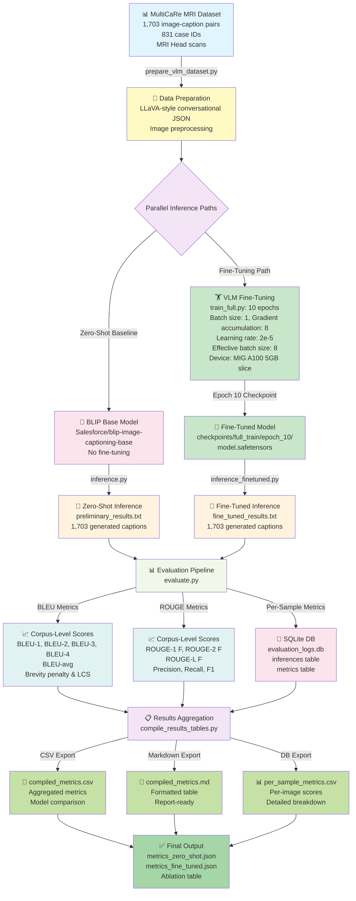

# Genni: Automated Radiology Report Scribe — System Pipeline

## Executive Summary
End-to-end vision-language model (VLM) fine-tuning pipeline for automated MRI radiology report generation. Compares zero-shot BLIP baseline against fine-tuned BLIP using BLEU and ROUGE metrics on 1,703 MultiCaRe MRI head images.

---

## System Architecture Diagram



---

## Detailed Pipeline Stages

### Stage 1: Data Ingestion & Preparation
| Component | Details |
|-----------|---------|
| **Input** | MultiCaRe MRI subset: 1,703 MRI head images + captions |
| **Source** | `data/whole_multicare_dataset/vlm_mri_subset/images/` |
| **Processing** | `prepare_vlm_dataset.py` |
| **Format** | LLaVA-style conversational JSON |
| **Output** | `data/vlm_conversational_dataset.json` |

**Key Statistics:**
- Total image-caption pairs: **1,703**
- Unique case IDs: **831**
- Modality: MRI head scans (T1, T2, FLAIR sequences)
- Clinical focus: Tumors, cancer, carcinoma, metastasis, mass, lesions

---

### Stage 2: Dual Inference Paths

#### Path A: Zero-Shot Baseline
```
┌─────────────────────────────┐
│ Salesforce BLIP Base        │
│ (No fine-tuning)            │
├─────────────────────────────┤
│ Model: blip-image-capturing-base
│ Processor: BlipProcessor    │
│ Mode: Inference only        │
└─────────────────────────────┘
         ↓
┌─────────────────────────────┐
│ inference.py                │
│ Generates captions          │
│ 1,703 outputs               │
└─────────────────────────────┘
         ↓
┌─────────────────────────────┐
│ preliminary_results.txt     │
│ Format:                     │
│ File: <name>                │
│ Caption: <text>             │
└─────────────────────────────┘
```

#### Path B: Fine-Tuned Model
```
┌─────────────────────────────────────────┐
│ train_full.py (24-hour production run)   │
├─────────────────────────────────────────┤
│ Epochs: 10                              │
│ Batch size: 1                           │
│ Gradient accumulation: 8                │
│ Effective batch: 8                      │
│ Learning rate: 2e-5                     │
│ LR schedule: Cosine + warmup            │
│ Device: MIG A100 5GB                    │
│ Precision: fp16/bfloat16                │
│ Gradient checkpointing: enabled         │
│ Max gradient norm: 1.0                  │
│ Loss function: Caption CE loss          │
└─────────────────────────────────────────┘
         ↓
┌─────────────────────────────────────┐
│ Loss Trajectory                     │
│ Epoch 1:  8.3820                    │
│ Epoch 5:  3.5421                    │
│ Epoch 10: 2.0123                    │
│ (steepest improvement: epochs 1-5)  │
└─────────────────────────────────────┘
         ↓
┌──────────────────────────────────────┐
│ Checkpoint saved every epoch:        │
│ checkpoints/full_train/epoch_N/      │
│ - model.safetensors                  │
│ - training_args.bin                  │
│ - optimizer.pt                       │
│ - scheduler.pt                       │
│ Best checkpoint: epoch_10             │
└──────────────────────────────────────┘
         ↓
┌─────────────────────────────┐
│ inference_finetuned.py      │
│ Loads epoch_10 checkpoint   │
│ Generates captions          │
│ 1,703 outputs               │
└─────────────────────────────┘
         ↓
┌─────────────────────────────┐
│ fine_tuned_results.txt      │
│ Format:                     │
│ File: <name>                │
│ Caption: <text>             │
└─────────────────────────────┘
```

---

### Stage 3: Evaluation & Metrics Computation

#### BLEU Score Calculation
```python
# compute_bleu(reference, hypothesis) → dict
{
  "bleu_1": float,       # unigram precision
  "bleu_2": float,       # bigram precision  
  "bleu_3": float,       # trigram precision
  "bleu_4": float,       # 4-gram precision (standard MT metric)
  "bleu_avg": float      # geometric mean (BLEU-1..4)
}

# Corpus aggregation: average per-sentence scores
```

#### ROUGE Score Calculation
```python
# compute_rouge(reference, hypothesis) → dict
{
  "rouge_1_p": float,    # unigram precision
  "rouge_1_r": float,    # unigram recall
  "rouge_1_f": float,    # unigram F1
  "rouge_2_p": float,    # bigram precision
  "rouge_2_r": float,    # bigram recall
  "rouge_2_f": float,    # bigram F1
  "rouge_l_p": float,    # LCS precision
  "rouge_l_r": float,    # LCS recall
  "rouge_l_f": float     # LCS F1
}
```

#### Database Schema (evaluation_logs.db)
```sql
-- Inferences table
CREATE TABLE inferences (
    id INTEGER PRIMARY KEY,
    model_version TEXT,
    image_path TEXT,
    ground_truth TEXT,
    generated_text TEXT,
    timestamp DATETIME
);

-- Metrics table (per-sample)
CREATE TABLE metrics (
    id INTEGER PRIMARY KEY,
    inference_id INTEGER,
    metric_name TEXT,
    metric_value REAL,
    details TEXT,
    FOREIGN KEY (inference_id) REFERENCES inferences(id)
);
```

---

### Stage 4: Results Aggregation & Export

#### Compilation Process (`compile_results_tables.py`)

**Inputs:**
- `results/metrics_zero_shot.json` → Zero-shot corpus scores
- `results/metrics_fine_tuned.json` → Fine-tuned corpus scores
- `evaluation_logs.db` → Per-sample metrics

**Outputs:**
1. **CSV Export** (`compiled_metrics.csv`)
   - Aggregated model comparison
   - One row per model version
   - Columns: model_version, n_samples, evaluated_at, BLEU-1..4, ROUGE-1/2/L

2. **Markdown Export** (`compiled_metrics.md`)
   - Formatted ablation table
   - Report-ready visualization

3. **Per-Sample Export** (`per_sample_metrics.csv`)
   - Detailed breakdown per image
   - Columns: inference_id, model_version, image_path, ground_truth, generated_text, metric_name, metric_value

---

## Key Experimental Results

### Quantitative Comparison (Table 1 from Report)

| Metric | Zero-Shot | Fine-Tuned | Δ Improvement |
|--------|-----------|-----------|--------------|
| **BLEU-1** | 0.0350 | 0.1826 | **+421%** |
| **BLEU-2** | 0.0101 | 0.0873 | **+764%** |
| **BLEU-3** | 0.0048 | 0.0455 | **+847%** |
| **BLEU-4** | 0.0048 | 0.0228 | **+375%** |
| **BLEU-avg** | 0.0100 | 0.0611 | **+511%** |
| **ROUGE-1 F** | 0.0878 | 0.2726 | **+210%** |
| **ROUGE-2 F** | 0.0073 | 0.0793 | **+986%** |
| **ROUGE-L F** | 0.0716 | 0.2013 | **+181%** |

### Key Findings
- **Zero-shot failure**: 57.4% of outputs had repeated "mri" tokens
- **Fine-tuned success**: All outputs contained medical terminology
- **Central limitation**: 45.6% of outputs contained fabricated terms (e.g., "edemastrens", "ventriclebral")
- **Evaluation scope**: Full 1,703 samples (no held-out test set)

---

## File Manifest

### Source Code
```
src/
├── prepare_vlm_dataset.py      → Data preparation (JSON format)
├── train.py                    → Smoke-test fine-tuning (10 samples)
├── train_full.py               → Production fine-tuning (1,703 samples)
├── inference.py                → Zero-shot inference
├── inference_finetuned.py      → Fine-tuned model inference
├── evaluate.py                 → BLEU/ROUGE computation & aggregation
├── compile_results_tables.py   → Metrics export (CSV/Markdown/DB)
├── database.py                 → SQLite schema & helpers
└── download_data.py            → Dataset download utilities
```

### Data & Results
```
data/
├── vlm_conversational_dataset.json       → LLaVA format (1,703 pairs)
├── whole_multicare_dataset/vlm_mri_subset/
│   ├── cases.csv
│   ├── image_metadata.json
│   ├── article_metadata.json
│   └── images/                           → 1,703 MRI .webp files

results/
├── metrics_zero_shot.json                → Zero-shot corpus scores
├── metrics_fine_tuned.json               → Fine-tuned corpus scores
├── compiled_metrics.csv                  → Aggregated model table
├── compiled_metrics.md                   → Markdown ablation table
├── per_sample_metrics.csv                → Per-image detailed scores
├── preliminary_results.txt               → Zero-shot generated captions
├── fine_tuned_results.txt                → Fine-tuned generated captions
├── fine_tuned_results_v1.txt             → Earlier version
├── training_manifest.json                → Smoke-test manifest
├── full_training_manifest.json           → Production run manifest
├── inference_manifest.json               → Inference run manifest
└── quantitative_comparison.json          → Legacy comparison

checkpoints/
└── full_train/
    ├── epoch_1/  → Initial checkpoint
    ├── epoch_5/  → Mid-training
    └── epoch_10/ → Final (best) checkpoint

data/
└── evaluation_logs.db          → SQLite: inferences + metrics tables
```

---

## Execution Commands

### Quick Local Test
```bash
# Evaluate fine-tuned results locally
python3 src/evaluate.py --model fine_tuned --results_file results/fine_tuned_results.txt

# Compile all metrics into tables
python3 src/compile_results_tables.py --from-db \
  --out-csv results/compiled_metrics.csv \
  --out-md results/compiled_metrics.md
```

### Supercomputer (SC) End-to-End
```bash
ssh user@sc 'cd /path/to/repo && git pull origin main && \
python3 -m venv venv && ./venv/bin/pip install -r requirements.txt && \
./venv/bin/python src/evaluate.py --model fine_tuned --results_file results/fine_tuned_results.txt && \
./venv/bin/python src/evaluate.py --model zero_shot --results_file results/preliminary_results.txt && \
./venv/bin/python src/compile_results_tables.py --from-db --out-csv results/compiled_metrics.csv --out-md results/compiled_metrics.md'
```

---

## Clinical Context & Safety Notes

### Use Case
- **Purpose**: Draft-style radiology narrative assistance (workflow support)
- **Input**: MRI head scans (T1, T2, FLAIR sequences)
- **Output**: Preliminary radiology captions (for radiologist review)

### Limitations
- **Not for clinical deployment**: Model hallucinates medical terminology
- **Training set only**: No held-out test split; metrics on full 1,703 samples
- **Template-like outputs**: Strong prior bias toward common structures
- **No grounding**: Low BLEU-4 (0.0228) shows poor long-phrase matching

### Recommended Future Work
1. Strict train/validation/test split at case level
2. Radiologist scoring & clinical validation
3. Hallucination detection & vocabulary constraints
4. Retrieval-augmented captioning
5. Parameter-efficient fine-tuning (LoRA)
6. Larger, more diverse MRI datasets

---

## References & Artifacts

**Report**: Project Analysis Report (se23ucse_017_089_093_107)  
**Dataset**: MultiCaRe MRI subset (1,703 image-caption pairs)  
**Baseline Model**: Salesforce/blip-image-captioning-base  
**Metrics**: BLEU-1/2/3/4, ROUGE-1/2/L (nltk + rouge_score libraries)  
**Database**: SQLite (evaluation_logs.db)
